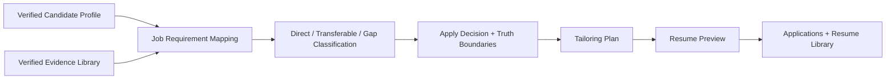
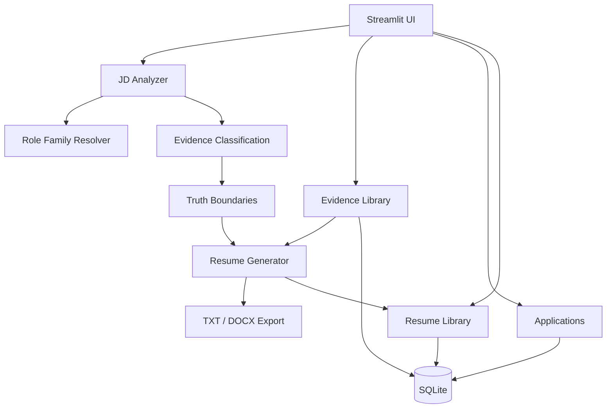

# JobPilot

### Evidence-First Job Search Decision Support

JobPilot helps candidates decide whether a role is worth pursuing, understand how their verified experience transfers, identify material gaps, and preview truthful resume wording before applying.

It is designed for cross-functional and cross-industry candidates whose experience is often undervalued by simple keyword matching.

[](https://job-pilot-and-resume-tailor.streamlit.app/)
[](https://github.com/Sue0202/job-pilot-and-resume-producer)

---

## Why I Built It

Most job-search tools focus on keyword overlap or resume rewriting. That creates two problems:

- transferable experience can be undervalued when the exact industry or system name is missing;
- generic resume generators can overstate ownership or introduce unsupported claims.

JobPilot separates four questions before generating any resume output:

1. What evidence is directly relevant?
2. What evidence is transferable but needs translation?
3. What gaps are material enough to affect the apply decision?
4. What wording can be generated without overstating experience?

---

## Try the 60-Second Demo

1. Open the [live app](https://job-pilot-and-resume-tailor.streamlit.app/).
2. Click **Try the 60-second demo**.
3. Review the preloaded Product Operations job description.
4. Click **Analyze Fit**.
5. Review the decision, strengths, transferable evidence, and material gaps.
6. Open **Review Tailoring Plan**.
7. Click **Generate Tailored Resume Preview**.
8. Save the job, save the resume version, or download the output.

The demo uses a synthetic Product Operations job description and a public-safe candidate profile.

---

## Core Workflow



**Analyze Job → Decide → Review Evidence → Tailor Resume → Track Application → Preserve Version History**

---

## Product Principles

### Evidence first

Resume generation starts from the verified master profile and, when available, verified Evidence Library items. Temporary notes are not silently promoted into reusable evidence.

### Decision before generation

JobPilot first answers **whether the role is worth pursuing**, then explains **how the candidate's experience should be positioned**.

### Transferability is not direct ownership

The product distinguishes:

- direct domain evidence;
- transferable evidence;
- adjacent workflow experience;
- unsupported capability;
- hard eligibility constraints.

### Explicit truth boundaries

When direct evidence is missing, JobPilot surfaces a boundary such as:

> **Truth boundary: No direct Salesforce ownership.**

Adjacent workflow experience may still be shown, but it is not converted into an unsupported proficiency claim.

### Explainability over false precision

The main Decision Summary prioritizes recommendation, material-gap risk, confidence, role family, and positioning guidance. Numerical scores remain available in the detailed breakdown, but they are not presented as hiring probability.

---

## Main Capabilities

### Analyze Job

Paste a job description or load the built-in Product Operations sample to receive:

- an apply recommendation and priority;
- material-gap risk;
- confidence and role-family classification;
- direct evidence;
- transferable evidence;
- preferred-tool and eligibility gaps;
- recommended positioning;
- a detailed component breakdown.

### Review Tailoring Plan

Before generation, JobPilot shows:

- the selected positioning angle;
- evidence chosen for the role;
- job themes to emphasize;
- job-description language to mirror;
- explicit truth boundaries;
- matching details in a collapsed expander.

### Generate Tailored Resume Preview

The deterministic resume builder preserves the candidate's real structure:

- Profile;
- Areas of Expertise;
- Professional Experience;
- Education.

Users can refine positioning, regenerate a version, download TXT or DOCX, and save the generated resume.

### Applications

Applications provides a lightweight job pipeline with:

- Saved / To Apply;
- Applied;
- Interview;
- Offer;
- Closed / Rejected;
- filters and search;
- notes and next-action tracking;
- single-record entry and CSV import.

### Resume Library

Resume Library preserves generated versions and displays:

- total versions;
- versions created this week;
- jobs with tailored resumes;
- company, angle, and search filters;
- **Match score (0–100)**;
- refinement notes;
- TXT and DOCX downloads.

### Evidence Library

Evidence Library captures reusable career evidence with fields for context, ownership, outcomes, skills, tags, and verification status. Only verified evidence is eligible for reuse in resume generation.

---

## Key Product Decisions

### Separate analysis from resume matching

JobPilot uses two scoring contexts:

- **Analysis score (0–10):** role-level fit and apply prioritization.
- **Match score (0–100):** resume-to-job language and keyword alignment.

The UI labels them separately so users do not compare unlike metrics.

### Keep numerical scores secondary

The primary Decision Summary is qualitative. Numerical component scores are placed under **Detailed fit scores & component breakdown**.

### Preserve provenance

Generated wording remains traceable to verified candidate material. Generation does not overwrite the master profile, and saved outputs remain available in Resume Library.

### Keep the public demo safe

The demo profile removes private contact details and unsupported claims. Public output uses safe placeholders and truth-bounded wording.

### Preserve advanced work without blocking the main journey

The original course-project ranking and analytics capabilities remain under **Advanced (course project)**, while the default flow stays focused on recruiter-friendly decision support.

---

## Architecture



### Tech stack

- **Python** — analysis, translation, generation, and workflow logic
- **Streamlit** — UI and navigation
- **SQLite** — analyses, applications, feedback, and resume versions
- **pandas** — tabular workflows and analytics
- **scikit-learn** — TF-IDF ranking and cosine similarity
- **python-docx** — DOCX export
- **sentence-transformers** — optional dense retrieval for advanced ranking

No external AI API is required for the primary workflow. Resume generation is rule-based and deterministic.

---

## Scoring Model

JobPilot uses conservative scoring to support decisions, not predict hiring outcomes.

The analysis considers:

- role fit;
- experience fit;
- skill fit;
- seniority fit;
- industry transferability;
- sponsorship feasibility;
- resume evidence strength;
- hard requirements and eligibility constraints.

Hard constraints can cap or reduce the recommendation. Transferable evidence can improve positioning without being relabeled as direct ownership.

---

## Validation

The portfolio MVP was validated through:

- all 15 automated test modules passing;
- syntax checks on modified Python files;
- local Streamlit smoke testing;
- Streamlit Community Cloud smoke testing;
- Product Operations demo completion;
- job analysis and decision rendering;
- tailoring-plan rendering;
- resume preview generation;
- resume-version persistence;
- application persistence;
- TXT and DOCX downloads;
- sidebar navigation checks;
- public-profile and unsupported-claim review.

---

## Advanced Course-Project Capabilities

JobPilot began as a UC Davis BAX423 Big Data final project. The original technical capabilities remain available under **Advanced (course project)**:

- TF-IDF job ranking;
- optional dense-vector retrieval;
- hybrid ranking;
- ranking-method comparison;
- feedback-aware recommendations;
- external job-data preprocessing;
- batch market insights;
- test personas;
- CSV downloads and imports.

These capabilities are preserved as engineering evidence but are not required for the primary portfolio demo.

---

## External Job Data Pipeline

The advanced ranking workflow supports a large MongoDB-style raw job snapshot that is preprocessed outside the Streamlit runtime.

The preprocessing pipeline incrementally reads the source, strips HTML, normalizes fields, deduplicates records, classifies role families, filters relevant jobs, and writes smaller CSVs for interactive use.

The raw dataset is excluded from Git. The app falls back to committed sample data when larger processed files are unavailable.

---

## Run Locally

```bash
git clone https://github.com/Sue0202/job-pilot-and-resume-producer.git
cd job-pilot-and-resume-producer
pip install -r requirements.txt
streamlit run app.py
```

The SQLite database is created automatically on first run.

The primary demo does not require the external processed job dataset. Advanced ranking pages fall back to committed sample data when larger files are unavailable.

---

## Deployment

The public demo is deployed on Streamlit Community Cloud:

- **Live app:** https://job-pilot-and-resume-tailor.streamlit.app/
- **Repository:** https://github.com/Sue0202/job-pilot-and-resume-producer

Streamlit Community Cloud uses an ephemeral filesystem. Local database records and profile edits may reset after reboot or redeployment, which is acceptable for this portfolio MVP.

---

## Repository Guide

| File | Purpose |
|---|---|
| `app.py` | Streamlit UI, routing, and workflow orchestration |
| `jd_analyzer.py` | Job parsing, fit analysis, decision logic, and calibration |
| `resume_generator.py` | Deterministic resume generation |
| `resume_review.py` | Resume review and refinement workflow |
| `database.py` | SQLite persistence |
| `evidence_verbal.py` | Evidence-language management and quality controls |
| `experience_translation.py` | Transferable-experience translation |
| `role_family_resolver.py` | Role-family resolution and positioning |
| `verbal_retrieval.py` | Evidence and verbal retrieval |
| `docx_export.py` | DOCX export |
| `matching.py` | TF-IDF, dense, and hybrid ranking |
| `analytics.py` | Aggregate job-data analytics |
| `preprocess_jobs.py` | Raw job-data preprocessing |
| `candidate_master_profile.md` | Verified candidate material |
| `requirements.txt` | Python dependencies |

---

## Scope and Limitations

This is a portfolio MVP, not an ATS predictor or hiring-probability model.

It intentionally does not:

- auto-apply to jobs;
- scrape private job platforms;
- claim unsupported candidate experience;
- provide production-grade authentication;
- provide durable cloud database storage;
- use external AI APIs for the primary workflow;
- predict interview or offer probability.

Future production work would include authenticated accounts, durable managed storage, stronger provenance metadata, richer evidence review, and production-grade observability.

---

## Project Status

The evidence-first portfolio workflow is complete and deployed. The current version prioritizes a concise, explainable recruiter demo while preserving the original data-engineering and ranking work under the Advanced section.
